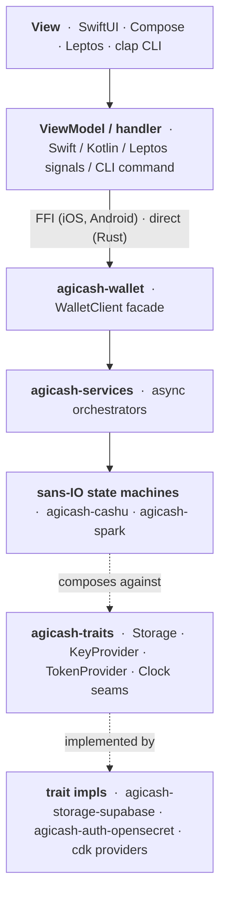

# agicash-rs

Experimental rewrite of [MakePrisms/agicash](https://github.com/MakePrisms/agicash) as a multi-platform Rust workspace.

A pure-Rust core in `crates/` is consumed by four shells: a CLI binary, a SwiftUI iOS app, a Kotlin Android app, and a Leptos browser PWA. iOS + Android consume the core through UniFFI; the PWA consumes it as wasm. Identity + seeds live in [OpenSecret](https://opensecret.cloud); wallet rows live in Supabase Postgres.

## Quick start

```sh
# Prereqs: Nix (flakes enabled) + direnv hooked into your shell.
git clone git@github.com:gudnuf/agicash-rs.git ~/agicash
cd ~/agicash
direnv allow            # populates the flake shell (first run ~5 min)
```

Bring up the local stack (separate checkouts run alongside):

```sh
(cd ~/opensecret && cargo run) &      # OpenSecret enclave on :3999
bunx supabase start                   # Supabase on :54321
```

Copy `.env.example` to `.env` and fill in `SUPABASE_ANON_KEY` + `SUPABASE_SERVICE_ROLE_KEY` from `bunx supabase status`. Everything else has flake defaults.

Canary:

```sh
acli auth guest
acli account list
```

Stack details: `docs/local-stack.md`.

## Shell functions

In the flake shell (`nix develop`):

| Function | What it runs |
|---|---|
| `acli` | `cargo run -p agicash-cli --` |
| `aweb` | leptos PWA dev loop |
| `atest` / `abuild` / `aclippy` / `afmt` | `cargo test`/`build`/`clippy`/`fmt --all` on the workspace |
| `awasm` | wasm32 build of `agicash-wasm` |
| `acodegen` | regenerate Supabase types |

## Repo layout

| Path | Contents |
|---|---|
| `crates/` | Rust core. Layout in `crates/README.md`. |
| `bindings/{swift,kotlin}/` | UniFFI bindings + `generate-bindings.sh`. |
| `ios/Agicash/` | SwiftUI app. `project.yml` is xcodegen input. |
| `android/Agicash/` | Kotlin app. Gradle. |
| `nix/` | Per-environment dev shells (`default`, `ios`, `android`, `wasm`). |
| `supabase/` | Local Supabase config + SQL migrations. |
| `docs/` | Architecture, specs, plans, audits. |

## How it composes



Sans-IO state machines hold all the protocol logic without async or I/O; orchestrators in `agicash-services` glue them to concrete providers; `WalletClient` aggregates the orchestrators. Swapping a backend (real Supabase → in-memory fake for tests, alt auth provider, etc.) is a trait-impl swap at the composition root, not a rewrite. Full walk-through: `docs/architecture.md`.

## Platform builds

| Target | Commands |
|---|---|
| iOS xcframework | `nix develop .#ios && bindings/swift/generate-bindings.sh` → open `ios/Agicash/` in Xcode |
| Android APK | `nix develop .#android && bindings/kotlin/generate-bindings.sh && (cd android/Agicash && ./gradlew assembleDebug)` |
| Leptos PWA | `nix develop .#wasm && aweb` (output: `crates/agicash-web-leptos/target/site/`, static-hostable) |
| CLI binary | `abuild --release -p agicash-cli` (output: `$CARGO_TARGET_DIR/release/agicash`) |

## More docs

- `docs/architecture.md` — layered architecture, per-crate dependency map
- `docs/local-stack.md` — OpenSecret + Supabase + cert setup details
- `docs/supabase.md` — schema, migrations, event system, hosted deploys
- `docs/testing.md` — test layout, feature-gated real-service tests
- `docs/contributing.md` — code style, branching, CI
- `docs/migration-from-react.md` — pointer to the React app archive
- `crates/README.md` — per-crate layout + dependencies
- `nix/README.md` — per-environment dev shell details
